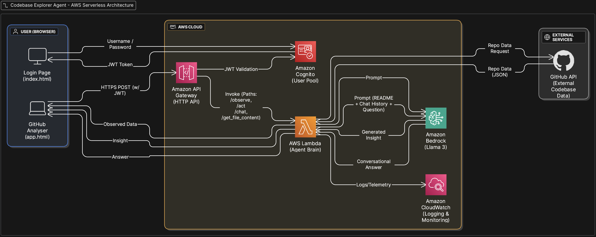

# 🚀 Codebase Explorer Agent 🚀
**Submission for the Agentic AI x AWS Challenge (Track 2: Codebase & Repository Explorer)**

### 🎥 Quick Demo
[Link to Your 3-Minute Demo Video Here]

---

### 🎯 The Challenge & Our Objective

**The Problem:** The challenge for Track 2 was to build a system that can "make sense of a collection of repos" and provide a "clear understanding of what's happening inside them."

**Our Solution:** We built the **Codebase Explorer Agent**, a secure, serverless application that moves beyond simple code retrieval. It provides actionable, contextual intelligence on any public GitHub repository by implementing a complete **Explore → Reason → Act** agentic workflow, orchestrated from a professional "cockpit" UI and powered by Amazon Bedrock.

---

### 🏛️ System Architecture

Our entire system is built on a 100% serverless, event-driven AWS stack. This design is secure, scalable, and extremely cost-effective. All API traffic is secured and routed through a central API Gateway, with all logic and reasoning handled by a single "brain" Lambda function.

**The flow is as follows:**

1.  **Authentication:** A user signs in via the **Frontend** (`index.html`), which authenticates against **Amazon Cognito** to receive a secure JWT.
2.  **API Routing:** Every subsequent request from the **Agent Cockpit** (`app.html`) is sent with this JWT to **Amazon API Gateway**. The gateway validates the token and routes the request.
3.  **Agent Brain:** All requests (`/observe`, `/act`, `/chat`) are sent to the central **AWS Lambda** function, which acts as the agent's brain.
4.  **Observe/Act:**
    * For **Observe** tasks, the Lambda calls the **GitHub API** to gather data.
    * For **Reason/Act** tasks, the Lambda constructs a precise prompt and invokes **Amazon Bedrock (Llama 3)** to generate insights.
5.  **Monitoring:** All operations, logs, and telemetry are captured by **Amazon CloudWatch**, ensuring stability and providing a clear audit trail.

---

### 🧠 Agentic Behavior: The Observe → Reason → Act Loop

This project perfectly demonstrates the **Observe → Reason → Act** loop, fulfilling the core "Agentic Behavior" evaluation criteria (25 pts).

**1. Observe 🔭**
* **Action:** The user provides a GitHub URL and clicks "Analyze Repo."
* **Agentic Process:** This triggers the `/observe` endpoint. The Lambda function (`observe_repository`) executes the **Observe** phase, gathering all necessary intelligence from the GitHub API.
* **Output:** A complete "world model" of the repo, including:
    * Full README content
    * The entire recursive file tree
    * Recent commit history
    * Language statistics
    * Key dependency files (`package.json`, `requirements.txt`)

**2. Reason 🤔**
* **Action:** The agent now has data and a list of tasks (e.g., "Summarize Repo Purpose," "Identify Tech Stack").
* **Agentic Process:** This is the **Reason** phase. The Lambda function (`execute_action`) does not just execute fixed steps; it *reasons* about the task at hand. It dynamically selects the *specific slices of observed data* needed for that task and *crafts a precise prompt* for Amazon Bedrock.
* **Example:** For the "Tech Stack" task, it reasons that it must combine data from `languages`, `package.json`, and `requirements.txt` into a single, focused prompt.

**3. Act 💡**
* **Action:** The Lambda function calls Bedrock with the crafted prompt.
* **Agentic Process:** This is the **Act** phase. Amazon Bedrock generates the requested insight (the summary, the tech list, etc.). This result is then passed back to the frontend and displayed to the user in the "Agent Report" panel.

---

### ✨ Innovation & Key Features (Going Beyond the Base Idea)

We were "much encouraged to go beyond the base idea", and we focused on two innovative, high-impact agentic features.

#### 1. Contextual File Explainer
This is our most innovative feature. A user can click *any file* in the repository's file tree, and the agent will explain it.
* **Simple Approach:** Just send the code to Bedrock.
* **Our Agentic Approach:** Our agent **Reasons** that to provide a *useful* explanation, it needs more than just the code. It dynamically pulls the **README content (as project context)** and the **file's raw code**, combines them into a sophisticated prompt, and asks Bedrock to explain the file's *purpose and role within the project*. This provides a far more valuable insight.

#### 2. Context-Aware Chat Assistant
The chat panel isn't a simple Q&A bot. It's a true agent assistant.
* **Persistent Context:** The agent is given the full README content as its base "system context."
* **Conversational Memory:** The agent also receives the *entire chat history* with every new question.
* **Self-Correction (Stability):** The agent is designed for robustness. Our Lambda function (`chat_with_repo`) actively monitors the token length. If the context gets too large, it first **Reasons** that it must summarize the conversation history, creating a "condensed memory" before answering the user's new question. This prevents token-limit errors and demonstrates advanced, stable agent design.

#### 3. Robust & Stable by Design
The entire application is built to "run reliably... without breaking" (25 pts for Technical Functionality).
* **Defensive Coding:** Our Lambda function includes a `summarize_if_large` helper to pre-process large READMEs or files *before* sending them to Bedrock.
* **Native Libraries:** We intentionally used Python's built-in `urllib` for API calls to avoid Lambda deployment issues with external libraries like `requests`, ensuring a stable and lean deployment.

---

### 💻 Frontend: The Agent Cockpit

The frontend is a fully-functional, responsive, and secure single-page application that serves as the "cockpit" for our agent.

* **Professional UI:** Designed with a clean, dark, 3-panel layout (Explorer, Analyzer, Chat) that is intuitive for a technical user.
* **Secure by Default:** Uses the Amazon Cognito SDK to handle a secure SRP authentication flow. The retrieved JWT is stored and attached to every API call, securing the entire backend.
* **Workflow-Driven Design:** The UI is *built* to demonstrate the agentic workflow:
    1.  The **Explorer** panel (left) populates after the **Observe** phase.
    2.  The **Agent Report** (center) populates during the **Act** phase.
    3.  The **Chat** panel (right) provides a continuous **Reason/Act** loop for the user.

---

### 🛠️ Technology Stack

* **Frontend:** HTML5, Bootstrap 5, JavaScript (ES6+), `amazon-cognito-identity-js`
* **Security:** Amazon Cognito (User Pools)
* **API Layer:** Amazon API Gateway (HTTP API w/ JWT Authorizer)
* **Backend Logic:** AWS Lambda (Python 3.12)
* **AI Reasoning:** Amazon Bedrock (Meta Llama 3 8B Instruct)
* **Monitoring:** Amazon CloudWatch
* **External Data:** GitHub REST API